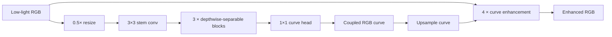

# UltraLiteDCE

A tiny PyTorch low-light image enhancement model built around the Zero-DCE curve formulation, redesigned for fast CPU / ONNX inference.

> **707 parameters · 10.6M MACs @ 256×256 · 1.34 ms ONNX CPU @ 256×256**

UltraLiteDCE keeps the iterative curve-enhancement idea of Zero-DCE, but compresses the curve estimator with half-resolution prediction, depthwise-separable convolutions, a shared curve map, and fewer enhancement iterations.

[中文说明](README_cn.md) · [Architecture](docs/ARCHITECTURE.md) · [Training & inference](docs/USAGE.md) · [Benchmarks](docs/BENCHMARKS.md)

## Why this project

The goal is not to maximize model size or benchmark score. It is to explore how far a curve-based LLIE model can be compressed while remaining practical, trainable, exportable, and visually stable.

The default configuration uses:

- **707 trainable parameters**
- **3 depthwise-separable blocks**
- **4 curve iterations**
- **one shared RGB curve map**
- **0.5× curve-prediction resolution**
- **coupled color parameterization** to reduce fixed color bias
- paired LOL supervision plus zero-reference constraints
- ONNX export with dynamic batch / height / width

## Architecture at a glance



The enhancement equation is:

```text
I_next = I + A * I * (1 - I)
```

For implementation details, see [docs/ARCHITECTURE.md](docs/ARCHITECTURE.md).

## Measured result

Evaluation below is from the current repository's 60-epoch LOL-v1 `eval15` comparison.

| Model | Params | MACs @256 | PSNR | SSIM | PyTorch CPU @256 | ONNX CPU @256 |
|---|---:|---:|---:|---:|---:|---:|
| **UltraLiteDCE** | **707** | **10.6M** | **18.5606** | 0.5509 | **3.60 ms** | **1.34 ms** |
| ZeroDCE-style baseline | 66,424 | 4.33B | 18.1758 | **0.5561** | 79.71 ms | 9.12 ms |

UltraLiteDCE is roughly **94× smaller by parameter count** and requires about **408× fewer MACs** than the baseline configuration used here, while reaching slightly higher PSNR in this run.

The baseline retains a small SSIM advantage, so this is best read as a speed / compactness trade-off rather than a claim of universal image-quality superiority.

Full numbers and measurement notes: [docs/BENCHMARKS.md](docs/BENCHMARKS.md).

## Quick start

### 1. Install

```bash
python -m venv .venv
# Windows: .venv\Scripts\activate
# Linux/macOS: source .venv/bin/activate

python -m pip install --upgrade pip
pip install -r requirements.txt
```

For GPU training, install the PyTorch build matching your CUDA environment.

### 2. Prepare LOL-v1

```text
data/LOL/
├── our485/
│   ├── low/
│   └── high/
└── eval15/
    ├── low/
    └── high/
```

### 3. Train

```bash
python train.py \
  --config configs/comparison/ultralite_color_safe_gpu_denoise_60.yaml \
  --epochs 60 \
  --device cuda
```

### 4. Evaluate

```bash
python evaluate.py \
  --config configs/comparison/ultralite_color_safe_gpu_denoise_60.yaml \
  --checkpoint outputs/color_safe_gpu_denoise/checkpoints/best_psnr.pt \
  --device cuda
```

### 5. Run inference

```bash
python infer.py \
  --checkpoint outputs/color_safe_gpu_denoise/checkpoints/best_psnr.pt \
  --input path/to/low.png \
  --output outputs/infer/enhanced.png
```

More commands: [docs/USAGE.md](docs/USAGE.md).

## Repository layout

```text
UltraLiteDCE/
├── configs/               # model / experiment configurations
│   ├── ablation/
│   └── comparison/
├── datasets/              # LOL paired dataset + synthetic smoke data
├── losses/                # zero-reference and supervised losses
├── models/                # UltraLiteDCE, curve operator, conv blocks
├── tests/                 # model, dataset, loss, ONNX and smoke tests
├── utils/                 # config, metrics, images, checkpoints, benchmark
├── docs/                  # architecture, usage and benchmark notes
├── train.py
├── evaluate.py
├── infer.py
├── benchmark.py
├── export_onnx.py
├── quantize_onnx.py
└── compare_baseline.py
```

## Core design decisions

| Decision | UltraLiteDCE | Motivation |
|---|---|---|
| Feature width | 8 | minimize parameters and activation cost |
| Conv type | depthwise separable | reduce compute |
| Curve prediction | 0.5× resolution | reduce spatial cost |
| Curve mode | shared | predict 3 channels instead of one map per iteration |
| Iterations | 4 | reduce iterative compute |
| Color mode | coupled | limit independent RGB drift |
| BatchNorm | none | simpler deployment and small-batch training |

## Training objective

The training setup combines:

- spatial consistency
- exposure control
- RGB color consistency
- curve total variation
- paired L1 reconstruction
- SSIM
- Sobel edge preservation
- dark-region smoothness
- saturation suppression

Each component is logged independently during training.

## Deployment

The repository includes:

- PyTorch CPU benchmarking
- ONNX export
- ONNX Runtime validation
- dynamic batch / height / width
- optional static QDQ INT8 preparation
- output consistency checks between PyTorch and ONNX

The measured ONNX max absolute error for UltraLiteDCE is on the order of `1e-7` in the current comparison.

## Tests

```bash
pytest -q
```

The current documented test suite covers model shape / range, odd image sizes, paired crop alignment, finite losses, gradients, checkpointing, ONNX consistency, inference integration, and a synthetic training smoke test.

## Notes

- The comparison model in this repository is a **ZeroDCE-style baseline**, not a claim of exact reproduction of every detail from the original Zero-DCE implementation.
- Dataset files, generated outputs, checkpoints, and ONNX binaries are intentionally excluded from Git.
- The project is intended as a compact LLIE / deployment experiment rather than a state-of-the-art benchmark claim.
