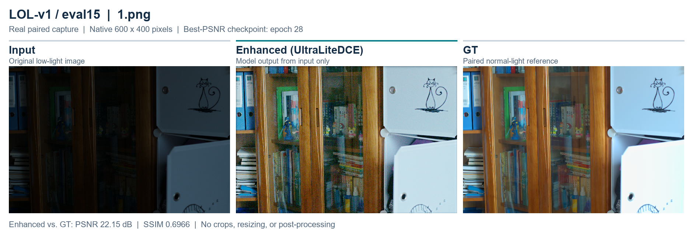
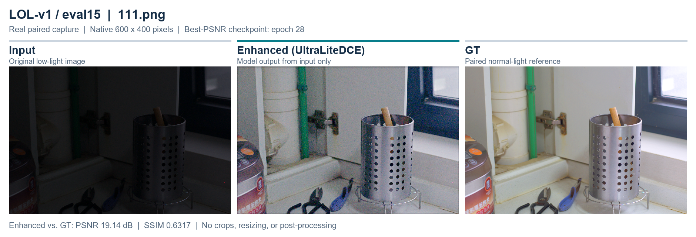
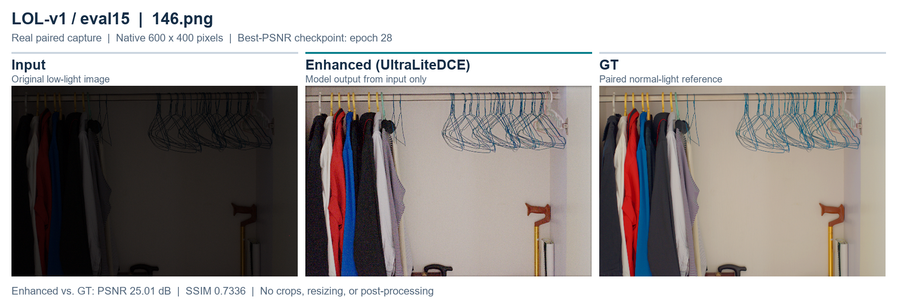
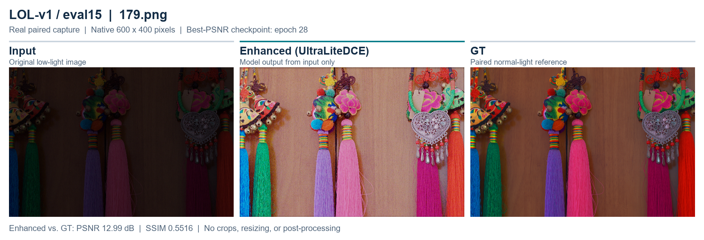

# UltraLiteDCE

UltraLiteDCE 是一个面向 CPU、移动端和 ONNX 部署的轻量低光照图像增强项目。核心仍保留 Zero-DCE 曲线增强公式：

```text
I_next = I + A * I * (1 - I)
```

项目使用 LOL paired dataset 训练，组合 zero-reference losses 与 paired supervision。当前优化重点是：在已经能提升亮度的基础上，减少暗区彩色噪声、降低局部颜色不自然和过度拉亮，同时保持模型轻量化。

README 中未实际跑出的质量和速度数值都标为“待测”，不包含伪造实验结果。

## 真实图像对比

下图按 **input → enhanced → GT** 排列，使用 [LOL-v1](https://daooshee.github.io/BMVC2018website/) `eval15` 中的真实低光／正常光配对图像。中间一列由 `outputs/color_safe_gpu_denoise/checkpoints/best_psnr.pt` 重新在 CPU 上推理得到；该 checkpoint 是文档中 60-epoch 训练在第 **28** 轮保存的最佳 PSNR 模型。GT 是配对的正常光拍摄图，仅用于评估。

这里展示**按文件名字典序排列的前四个样本**，没有按质量指标筛选。三列均保留原始 **600 × 400** 像素，不裁剪、不缩放，也不做额外后处理。点击图片可查看原尺寸。









这些样本包含效果较好和较弱的情况；增强结果的亮度、颜色仍可能与 GT 不同，`179.png` 尤其明显。图中 PSNR／SSIM 由仓库实现对转换为 8-bit 图像前的 float32 输出计算。[图像来源与复现说明](docs/assets/README.md)包含 checkpoint、原图的 SHA-256 和生成命令。

## 模型结构


图中为 **707 参数的对比实验配置**，标注了各层参数量、张量尺寸和原图支路。共享 RGB 曲线用于四次迭代，曲线在半分辨率预测，增强在原分辨率执行；可选暗区 denoise head 关闭。[查看 SVG 矢量图](docs/assets/architecture.svg)及[详细架构说明](docs/ARCHITECTURE.md)。

默认推荐轻量配置：

```yaml
model:
  width: 8
  num_blocks: 3
  num_iterations: 4
  curve_mode: shared
  prediction_scale: 0.5
  convolution: depthwise_separable
  curve_color_mode: coupled
  curve_chroma_scale: 0.05
  identity_init: true
  use_dark_denoise_head: false
```

与标准 Zero-DCE-style baseline 的主要区别：

- 默认宽度从 32 降到 8；
- 标准卷积替换为 depthwise separable convolution；
- curve map 默认在半分辨率预测；
- 默认只预测 3 通道 shared RGB curve，而不是 8 步共 24 通道；
- 默认迭代 4 次；
- 不使用 BatchNorm；
- 模型 forward 内直接完成 curve enhancement，方便部署；
- 加入 identity initialization、coupled curve、暗区平滑损失和 saturation protection，降低色偏与暗区彩噪风险。

`configs/baseline_dce.yaml` 提供 width=32、per-step curve、全分辨率和标准卷积的对照配置。

## 本次视觉质量优化

针对 60 epoch preview 中的红绿彩色噪声、暗区噪声放大和局部颜色不自然，本项目新增/调整：

- `DarkRegionSmoothnessLoss`：只在输入很暗的区域约束 enhanced 高频变化；
- 更强 `curve_tv`：默认优化配置从 20.0 提高到 50.0，抑制 per-pixel curve 抖动；
- 降低 exposure aggressiveness：`exposure=0.3`，`exposure_target=0.55`；
- 提高 paired supervision：`l1=2.0`，`ssim=0.5`，`edge=0.2`；
- 加强 saturation protection：`saturation=0.2`；
- 可选轻量暗区 denoise head：默认关闭，用于 ablation。

推荐先使用：

```bash
python train.py --config configs/ultralite_dce_denoise.yaml --device cuda --num-workers 2
```

如果要更保守地减少彩噪，请优先保持：

```yaml
model:
  curve_mode: shared
  num_iterations: 4
  prediction_scale: 0.5
```

## 环境安装

Windows PowerShell：

```powershell
python -m venv .venv
.\.venv\Scripts\Activate.ps1
python -m pip install --upgrade pip
pip install -r requirements.txt
```

Linux/macOS：

```bash
python3 -m venv .venv
source .venv/bin/activate
python -m pip install --upgrade pip
pip install -r requirements.txt
```

如需 CUDA，请按 PyTorch 官方页面安装与你显卡/驱动匹配的 `torch` wheel。LPIPS 和 NIQE 是可选指标：

```bash
pip install lpips
pip install pyiqa
```

## LOL-v1 数据目录

默认目录：

```text
data/LOL/
├── our485/
│   ├── low/
│   └── high/
└── eval15/
    ├── low/
    └── high/
```

也可在 YAML 中配置：

```yaml
data:
  root: data/LOL
  train_low: our485/low
  train_high: our485/high
  test_low: eval15/low
  test_high: eval15/high
```

low/high 按文件 stem 配对。训练时使用 paired random crop、水平/垂直翻转和 90 度旋转，所有增强都同步作用在 low/high 上。评估和推理保留原始分辨率，奇数尺寸可以直接推理。

## 训练与恢复

推荐优化训练：

```bash
python train.py --config configs/ultralite_dce_denoise.yaml --device cuda --num-workers 2
```

旧默认配置训练：

```bash
python train.py --config configs/ultralite_dce.yaml
```

恢复训练：

```bash
python train.py --config configs/ultralite_dce_denoise.yaml --resume outputs/ultralite_dce_denoise/checkpoints/last.pt
```

CLI 覆盖示例：

```bash
python train.py --config configs/ultralite_dce_denoise.yaml \
  --epochs 20 --batch-size 4 --device cuda \
  --set model.width=12 \
  --set model.curve_mode=per_step \
  --set model.num_iterations=6
```

没有 LOL 数据时可用 synthetic smoke test 验证流程，但 synthetic 指标不能作为真实结果：

```bash
python train.py --config configs/ultralite_dce_denoise.yaml --synthetic \
  --epochs 1 --batch-size 2 --num-workers 0 \
  --set training.crop_size=64 \
  --set data.synthetic_train_size=4 \
  --set data.synthetic_val_size=2
```

## 损失函数

每一项 loss 都会单独写入 CSV 和 TensorBoard：

- `spatial`：输入与增强图的局部亮度梯度一致性；
- `exposure`：局部平均曝光靠近 `exposure_target`；
- `color`：RGB 通道均值一致性，抑制整体色偏；
- `curve_tv`：curve map 空间平滑，减少逐像素曲线噪声；
- `l1`：paired 像素重建；
- `ssim`：paired 结构相似；
- `edge`：Sobel 水平/垂直边缘约束；
- `dark_smooth`：只在输入暗区抑制 enhanced 高频噪声；
- `saturation`：`mean(relu(enhanced - saturation_threshold))`；
- `chromaticity`：可选 RGB 比例约束，旧配置中启用，新优化配置默认不启用。

推荐优化 loss：

```yaml
loss:
  spatial: 1.0
  exposure: 0.3
  color: 0.5
  curve_tv: 50.0
  l1: 2.0
  ssim: 0.5
  edge: 0.2
  dark_smooth: 0.2
  saturation: 0.2
  exposure_target: 0.55
  dark_threshold: 0.25
  saturation_threshold: 0.95
```

## 输出目录

训练输出示例：

```text
outputs/ultralite_dce_denoise/
├── checkpoints/
│   ├── last.pt
│   ├── best.pt
│   ├── best_psnr.pt
│   ├── best_ssim.pt
│   └── final.pt
├── previews/
│   ├── epoch_0001_low_enhanced_gt.png
│   ├── epoch_0001_enhanced.png
│   └── epoch_0001_curve_map.png
├── tensorboard/
├── train_log.csv
├── train_loss.csv
├── validation_loss.csv
└── resolved_config.yaml
```

`best.pt` 与 `best_psnr.pt` 相同，按 validation PSNR 保存；`best_ssim.pt` 按 validation SSIM 保存。视觉质量不一定总和 PSNR 完全一致，建议同时看 preview。

## 评估、推理和 benchmark

评估 LOL eval15：

```bash
python evaluate.py \
  --config configs/ultralite_dce_denoise.yaml \
  --checkpoint outputs/ultralite_dce_denoise/checkpoints/best.pt
```

快速评估可减少 CPU benchmark 次数：

```bash
python evaluate.py \
  --config configs/ultralite_dce_denoise.yaml \
  --checkpoint outputs/ultralite_dce_denoise/checkpoints/best.pt \
  --set benchmark.iterations=10 \
  --set benchmark.warmup=2
```

推理单张图片或文件夹：

```bash
python infer.py \
  --checkpoint outputs/ultralite_dce_denoise/checkpoints/best.pt \
  --input data/LOL/eval15/low \
  --output outputs/ultralite_dce_denoise/eval15_enhanced
```

单独 benchmark：

```bash
python benchmark.py --config configs/ultralite_dce_denoise.yaml --checkpoint PATH
python benchmark.py --config configs/ultralite_dce_denoise.yaml --sizes 256 512 --warmup 20 --iterations 100 --threads 1
```

评估输出包括 PSNR、SSIM、MAE、参数量、checkpoint size、MACs、CPU 平均推理时间、标准差和 FPS。LPIPS/NIQE 需要安装可选依赖后用 `--lpips` / `--niqe` 启用。

## ONNX 导出

```bash
python export_onnx.py \
  --checkpoint outputs/ultralite_dce_denoise/checkpoints/best.pt \
  --output outputs/onnx/ultralite_dce.onnx
```

导出使用动态 batch/height/width，输入名为 `input`，输出名为 `enhanced`。脚本会执行 ONNX checker、ONNX Runtime 数值对齐，并报告最大/平均绝对误差和 ORT CPU benchmark。

卷积主导的小模型通常不会从 ONNX Runtime dynamic quantization 获得有效 INT8 卷积加速，因此项目不宣称 dynamic INT8 有效。可用代表性低光图做 calibrated static QDQ quantization：

```bash
python quantize_onnx.py \
  --model outputs/onnx/ultralite_dce.onnx \
  --output outputs/onnx/ultralite_dce_int8.onnx \
  --calibration-images data/LOL/our485/low \
  --limit 100
```

## Ablation 配置

新增三组配置：

```text
configs/ablation/baseline.yaml
configs/ablation/optimized_loss.yaml
configs/ablation/shared_curve_optimized.yaml
```

实验记录模板：

| Model | Curve Mode | Iterations | Scale | Params | PSNR | SSIM | MAE | CPU ms | Visual Noise |
|---|---|---:|---:|---:|---:|---:|---:|---:|---|
| Baseline | shared | 4 | 0.5 | 待测 | 待测 | 待测 | 待测 | 待测 | high |
| Optimized Loss | per_step | 4 | 0.5 | 待测 | 待测 | 待测 | 待测 | 待测 | medium |
| Shared Curve + Optimized Loss | shared | 4 | 0.5 | 待测 | 待测 | 待测 | 待测 | 待测 | low |

## 测试

```bash
pytest -q
```

测试覆盖 shape/range、shared/per-step、奇数尺寸、paired crop 对齐、loss finite、backward、checkpoint、ONNX 一致性、单图推理和 synthetic training smoke test。缺少 ONNX 依赖时，ONNX 测试会明确 skip。

## 常见问题

- 输出偏紫/偏色：不要 resume 旧的独立 RGB curve checkpoint；使用新输出目录重新训练，并优先用 coupled curve + shared mode。
- 暗区红绿噪声明显：使用 `configs/ultralite_dce_denoise.yaml`，观察 `dark_smooth`、`curve_tv` 和 preview；必要时把 `dark_smooth` 提到 `0.3` 或把 `prediction_scale` 降到 `0.25`。
- 画面过暗：适当提高 `exposure_target` 到 `0.58` 或降低 `dark_smooth`。
- 过曝/发灰：降低 `exposure` 或提高 `saturation`，检查 enhanced-only preview。
- Windows DataLoader 卡住：先用 `--num-workers 0`。
- CUDA OOM：降低 batch size/crop size，或使用 `prediction_scale=0.25`。
- PSNR/SSIM 平台后视觉仍差：优先看 `best_ssim.pt` 和 preview；PSNR 最高的 checkpoint 不一定视觉噪声最低。
- ONNX 缺包：安装 `onnx onnxruntime`；新 PyTorch 若提示缺 `onnxscript`，按提示安装。
## 60 epoch ONNX 与 ZeroDCE-style baseline 对比

本项目提供一套固定 60 epoch 的对比配置：

```text
configs/comparison/ultralite_color_safe_gpu_denoise_60.yaml
configs/comparison/zerodce_baseline_60.yaml
```

其中 UltraLiteDCE 配置参照 `outputs/color_safe_gpu_denoise/resolved_config.yaml`：

- width=8
- shared curve
- 4 iterations
- prediction_scale=0.5
- depthwise separable convolution
- optimized denoise/color-safe loss
- training.epochs=60

ZeroDCE-style baseline 使用：

- width=32
- per_step curve
- 8 iterations
- prediction_scale=1.0
- standard convolution
- training.epochs=60

先训练 baseline：

```powershell
python train.py `
  --config configs\comparison\zerodce_baseline_60.yaml `
  --epochs 60 `
  --num-workers 2 `
  --device cuda
```

如果要复现实验中的 UltraLiteDCE 训练，也可以运行：

```powershell
python train.py `
  --config configs\comparison\ultralite_color_safe_gpu_denoise_60.yaml `
  --epochs 60 `
  --num-workers 2 `
  --device cuda
```

已有 `outputs/color_safe_gpu_denoise/checkpoints/best_psnr.pt` 时可以直接导出 ONNX：

```powershell
python export_onnx.py `
  --config configs\comparison\ultralite_color_safe_gpu_denoise_60.yaml `
  --checkpoint outputs\color_safe_gpu_denoise\checkpoints\best_psnr.pt `
  --output outputs\onnx\ultralite_color_safe_gpu_denoise.onnx `
  --height 256 `
  --width 256 `
  --warmup 20 `
  --iterations 100
```

baseline 训练完成后导出：

```powershell
python export_onnx.py `
  --config configs\comparison\zerodce_baseline_60.yaml `
  --checkpoint outputs\zerodce_baseline_60\checkpoints\best_psnr.pt `
  --output outputs\onnx\zerodce_baseline_60.onnx `
  --height 256 `
  --width 256 `
  --warmup 20 `
  --iterations 100
```

一键生成 eval15 指标、CPU benchmark、ONNX 误差和对比表：

```powershell
python compare_baseline.py --device cuda
```

快速 smoke 版本：

```powershell
python compare_baseline.py --quick --device cuda
```

输出文件：

```text
outputs/comparison_60/
├── comparison_summary.csv
├── comparison_summary.json
├── comparison_table.md
├── ultralitedce_color_safe_gpu_denoise/
│   ├── evaluation/
│   └── onnx/
└── zerodce_style_baseline/
    ├── evaluation/
    └── onnx/
```

如果 baseline checkpoint 还不存在，`compare_baseline.py` 会在 summary 中标记 `missing_checkpoint`，不会伪造 baseline 的 PSNR/SSIM。
