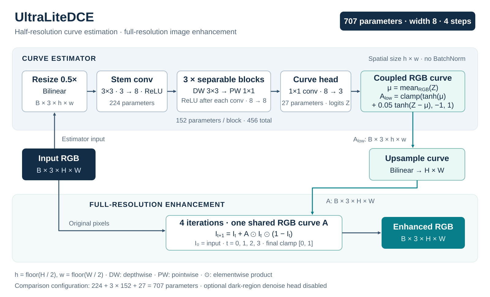

# Architecture

This note explains the default UltraLiteDCE model used in the repository's main comparison configuration.

## Design goal

UltraLiteDCE asks a narrow engineering question:

> How small can a Zero-DCE-style curve estimator become while still producing useful low-light enhancement and remaining easy to deploy?

The model therefore prioritizes:

1. low parameter count,
2. low spatial compute,
3. stable color behavior,
4. simple export,
5. end-to-end reproducibility.

## Forward path



[Open the vector diagram](assets/architecture.svg). This is the 707-parameter comparison configuration, with the optional dark-region denoise head disabled. For odd image dimensions, the prediction grid is `floor(H / 2) × floor(W / 2)`; the curve is resized back to the exact original dimensions.

## Curve formulation

The enhancement operation follows the Zero-DCE family of iterative curves:

```text
I_(n+1) = I_n + A_n * I_n * (1 - I_n)
```

The default model predicts one shared RGB curve map and reuses it for four iterations.

That differs from the repository's heavier baseline, which predicts a separate RGB curve map for each of eight iterations.

## Lightweight feature extractor

The default configuration uses width `8` and three depthwise-separable convolution blocks.

A depthwise-separable block consists of:

```text
3×3 depthwise convolution
        ↓
ReLU
        ↓
1×1 pointwise convolution
        ↓
ReLU
```

This keeps the representational path simple while reducing the cost of repeated full convolutions.

## Half-resolution curve prediction

The curve estimator runs on a 0.5× resized input.

The resulting curve map is then bilinearly upsampled back to the original image resolution before enhancement.

This is a major compute-saving choice because the feature extractor processes approximately one quarter of the original spatial pixels.

The enhancement itself still happens at full resolution.

## Shared curve mode

Two curve modes are supported:

### Shared

```text
curve head output = 3 channels
same RGB curve reused for every iteration
```

### Per-step

```text
curve head output = 3 × num_iterations channels
one RGB curve for each iteration
```

The default UltraLiteDCE configuration uses `shared`.

The comparison baseline uses `per_step`.

## Coupled color parameterization

Independent RGB curves can easily drift apart and create persistent color casts.

The default model instead decomposes the raw RGB curve logits into a luminance-like component and a chromatic residual:

```text
luminance_logits = mean(R, G, B)
luminance_curve  = tanh(luminance_logits)
chroma_curve     = tanh(rgb_logits - luminance_logits)

curve = clamp(
    luminance_curve + chroma_scale * chroma_curve,
    -1,
    1
)
```

The default `curve_chroma_scale` is `0.05`, so the model can still make channel-specific adjustments, but large independent RGB divergence is discouraged.

## Identity initialization

The curve head is initialized to output zero.

Because:

```text
I_next = I + 0 * I * (1 - I) = I
```

the network starts close to an identity mapping rather than immediately applying arbitrary enhancement.

This makes early optimization more stable and reduces strong initial color shifts.

## Optional dark-region denoise head

The implementation includes an optional residual denoise head operating only in dark regions.

It is disabled in the default 707-parameter comparison configuration.

When enabled, a dark mask is derived from the input grayscale intensity and a bounded residual is subtracted from the enhanced result.

## Default comparison configuration

```yaml
model:
  name: ultralite_dce
  width: 8
  num_blocks: 3
  num_iterations: 4
  curve_mode: shared
  prediction_scale: 0.5
  convolution: depthwise_separable
  curve_color_mode: coupled
  curve_chroma_scale: 0.05
  identity_init: true
  use_dark_denoise_head: false
```

## Comparison baseline

The repository's ZeroDCE-style baseline deliberately restores a much heavier configuration:

```yaml
model:
  width: 32
  num_blocks: 7
  num_iterations: 8
  curve_mode: per_step
  prediction_scale: 1.0
  convolution: standard
  curve_color_mode: independent
```

This makes the comparison useful for studying the engineering effect of the lightweight design choices.

It should not be interpreted as an exact reproduction of every implementation detail from the original Zero-DCE codebase.

## Where to look in the code

- `models/ultralite_dce.py`: network definition and curve prediction
- `models/blocks.py`: standard and depthwise-separable conv blocks
- `models/curve.py`: iterative curve application
- `configs/comparison/ultralite_color_safe_gpu_denoise_60.yaml`: default comparison config
- `configs/comparison/zerodce_baseline_60.yaml`: comparison baseline
